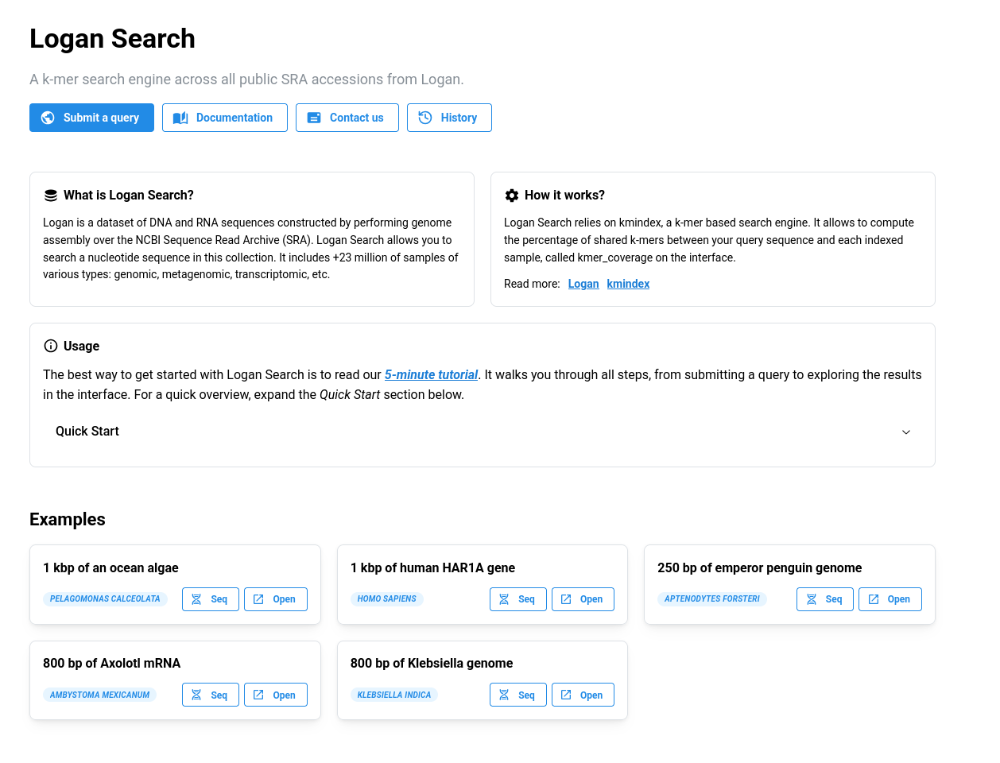
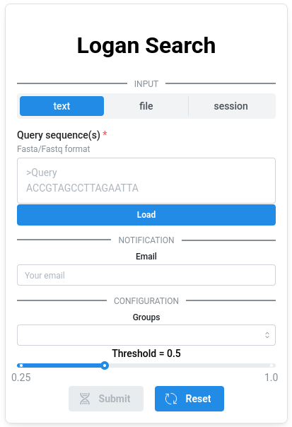
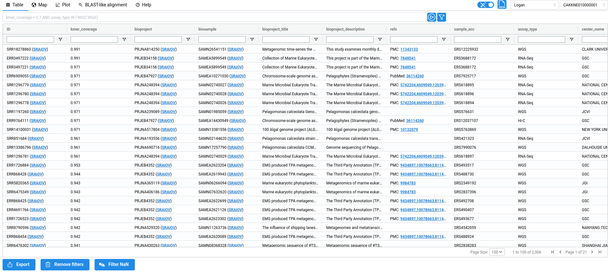
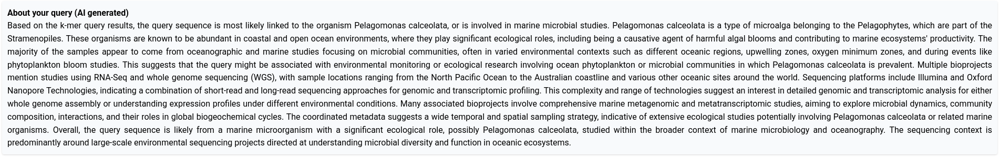
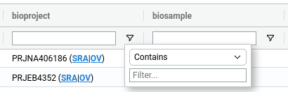
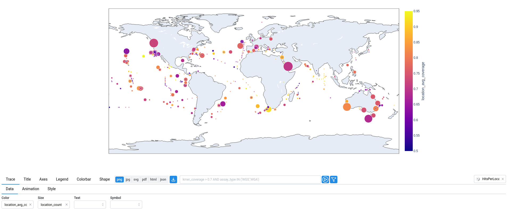
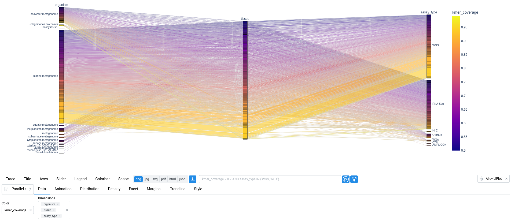
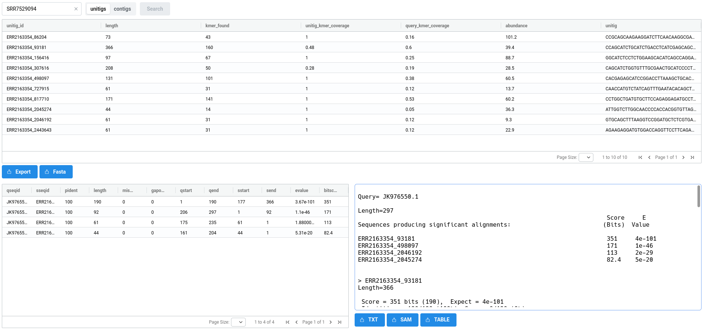

# Logan-Search

## **Introduction**

Logan is a dataset of DNA and RNA sequences constructed by performing genome assembly over the NCBI Sequence Read
Archive (SRA). The result is two sets of sequences, one corresponding to unitigs (1), and the other one to contigs (2).
{ .annotate }

1. In a De Bruijn Graph, unitigs are all the sequences corresponding to non-branching paths. In that
case, every k-mer that occurs more than twice in the original SRA sample will appear in the unitigs. Conversely,
any k-mer in the unitigs is also present somewhere in the original SRA reads.

2. Contigs are obtained by compacting unitigs, i.e. by making a choice at ambiguous bifurcations in the De Bruijn
Graph. Compared to unitigs, the only theoritical guarantee is that every k-mer in the contigs exists in the
original reads.

All assembled sequences from Logan are provided free of charge and are available for unrestricted download using [`awscli`](https://aws.amazon.com/cli/).

??? info "Download commands"
    Download a sample given its accession (*eg.* `SRR17555654`)

    **For unitigs**
    ```bash
    aws s3 cp s3://logan-pub/u/[accession]/[accession].unitigs.fa.zst . --no-sign-request
    ```

    **For contigs**
    ```bash
    aws s3 cp s3://logan-pub/c/[accession]/[accession].contigs.fa.zst . --no-sign-request
    ```
	

### *Which samples should you download?*

This is where Logan Search comes in. Logan Search allows you to query a DNA or RNA sequence across all Logan samples (xxx plus all the reference genomes from GenBank and RefSeq). By submitting a sequence,
you can, in a few minutes, find which samples contain it and explore the results directly in your browser.

### *How it works?*

Logan Search relies on kmindex, a k-mer (1) based search engine. Think of it like BLAST, but instead of aligning to genomes, it compares your query sequence
against Logan’s unitigs. For each sample, it computes the percentage of shared k-mers between your query sequence and the indexed unitigs.
{ .annotate }

1. A k-mer is a word of length *k*. In practice we used *k=31*.


## **Submitting a query**

You can submit a query using the dedicated button on the homepage, or directly via the following link: [logan-search.org/dashboard](https://logan-search.org/dashboard).


<figure markdown="span">
    { align=center }
    <figcaption>Logan-Search homepage</figcaption>
</figure>

<figure markdown="span">
    { align=center }
    <figcaption>Logan-Search submission form</figcaption>
</figure>

### *Required inputs*

#### 1. Sequence (required)

The query sequence must be provided in FASTA format, either by uploading a file or by pasting it into the text area. Each submission is limited to a single sequence with a maximum length of 2.5 kb.


#### 2. Groups (required)

The Logan Search index is composed of a large number of sub-indexes. You can choose to run your query across all of them or only a subset.

Available options (all include reference genomes from GenBank and RefSeq):

- `All`: all Logan unitigs - xxx million samples
- `All_No_viral_human`: excludes viral and human samples - xxx % of the total samples
- `Fast`: optimized subset for faster queries, also excluding viral samples - xxx % of the total samples (see below)
- `Fast_No_human`: same as Fast, but excluding human samples - xxx % of the total samples
- `GenBank_RefSeq`: only GenBank and RefSeq reference genomes - xxx % of the total samples

??? info "About `Fast` groups"
    The full index is composed of 2,869 sub-indexes. These sub-indexes group samples based on their superkingdom, sequencing type, and number of unique k-mers. Some combinations are rare and result in very small sub-indexes. These are excluded from `Fast`. Since querying each sub-index has a fixed computational cost regardless of its size or results, excluding these small sub-indexes significantly reduces query time while still covering the vast majority of Logan. In practice, the `Fast` option queries approximately 99.5% of all samples.

#### 3. Threshold (optional)

The minimum proportion of k-mers from the query required to consider a match, ranging from 0.25 to 1. Increasing this threshold makes the search more stringent (fewer but more confident matches), while lowering it increases sensitivity. XXXThis parameter has no impact on the query time. 


#### 4. Email (optional)

If you would like to be notified when your query is complete, you can provide your email address. Once the query finishes, you will receive two links: one to visualize the results and another to download them.


## **Exploring results**

The results page consists of four views: `Table`, `Map`, `Plot`, and `Blast-like alignment`.

### *1. Table*

The metadata table displays all results returned by your query, with one entry per match. Each row therefore corresponds to a single SRA sample. The metadata shown in the table originate from two sources. First, raw metadata are retrieved directly from the [Sequence Read Archive metadata](https://www.ncbi.nlm.nih.gov/sra/docs/sra-athena/). Second, these metadata are parsed and processed to infer additional information, such as tissues or diseases associated with the experiment. When possible, this information is further linked to standard ontologies, such as the [BRENDA Tissue Ontology](https://www.brenda-enzymes.org) (BTO) or the [Disease Ontology](https://disease-ontology.org/) (DO). All inferred fields are highlited in blue in the table.

<figure markdown="span">
    { align=center }
    <figcaption>Logan-Search metadata table</figcaption>
</figure>

??? info "Metadata description"
    - `acc`: Accession ID (SRA metadata)
    - `kmer_coverage`: Ratio of shared k-mer between the query and the sample
    - `ANI_estimation`: ANI estimation based on Mash Screen estimator: `E = (|Qk| & |Sk| / |Qk|)^(1/k)`, with `Qk` and `Sk` the query and sample k-mer sets
    - `bioproject`: Bioproject ID (SRA metadata)
    - `biosample`: Biosample ID (SRA metadata)
    - `bioproject_title`: Bioproject title (SRA metadata)
    - `bioproject_description`: Bioproject description (SRA metadata)
    - `refs`: References associated to accessions (From ENA xref)
    - `sample_acc`: Sample accession (SRA metadata)
    - `assay_type`: Sequencing type (SRA metadata)
    - `center_name`: Sequence center name (SRA metadata)
    - `experiment`: Experiment ID (SRA metadata)
    - `sample_name`: Sample name (SRA metadata)
    - `organism`: Organism (SRA metadata)
    - `disease_source`: The field from SRA metadata used to infer 'do_label' and 'do_id' (SRA metadata parsing + AI)
    - `disease_text`: The text from 'disease_source' used to infer 'do_label' and 'do_id' (SRA metadata parsing + AI)
    - `do_label`: The Disease ontology label, inferred from 'disease' (SRA metadata parsing + AI)
    - `do_id`: The Disease ontology ID, inferred from 'disease' (SRA metadata parsing + AI)
    - `tissue`: The sequenced tissue inferred from 'tissue_source' and 'tissue_text' (SRA metadata parsing + AI)
    - `tissue_source`: The field from SRA metadata used to infer 'tissue' (SRA metadata parsing + AI)
    - `tissue_text`: The text from 'tissue_source' field used to infer 'tissue' (SRA metadata parsing + AI)
    - `bto_id`: The BRENDA tissue ontology ID (SRA metadata parsing + AI)
    - `contigs_n50`: Contigs n50 (Logan assembly metadata)
    - `contigs_nbseq`: Number of contigs (Logan assembly metadata)
    - `contigs_maxlen`: Max contigs length (Logan assembly metadata)
    - `contigs_sumlen`: Sum of contig lengths (Logan assembly metadata)
    - `unitigs_n50`: Unitigs n50 (Logan assembly metadata)
    - `unitigs_nbseq`: Number of unitigs (Logan assembly metadata)
    - `unitigs_maxlen`: Max unitigs length (Logan assembly metadata)
    - `unitigs_sumlen`: Sum of unitig lengths (Logan assembly metadata)
    - `instrument`: Sequencing instrument (SRA metadata)
    - `librarylayout`: Library layout (SRA metadata)
    - `libraryselection`: Library selection (SRA metadata)
    - `librarysource`: Library source (SRA metadata)
    - `library_name`: Library name (SRA metadata)
    - `platform`: Sequencing Platform (SRA metadata)
    - `sra_study`: Study ID (SRA metadata)
    - `releasedate`: Release date (SRA metadata)
    - `mbytes`: Size of sequencing reads in megabytes (SRA metadata)
    - `avgspotlen`: (SRA metadata)
    - `mbases`: Size of sequencing reads in megabases (SRA metadata)
    - `biosamplemodel_sam`: (SRA metadata)
    - `collection_date_sa`: (SRA metadata)

To provide a quick overview of the query context, metadata associated with the top hits are supplied to a large language model (LLM) to generate a short summary.

<figure markdown="span">
    { align=center }
</figure>


??? info "Metadata fields used for the summary generation"
    The following fields are used: `kmer_coverage`, `bioproject_title`, `bioproject_description`, `releasedate`, `assay_type`, `latitude`, `longitude`, `organism`, `tissue`, `instrument`, `librarysource`, `platform`, `center_name`, `disease_text`

The metadata table serves as the central data source for all visualizations in the interface. This means that any operation applied to the table, such as filtering or sorting, will automatically update all figures. The reverse is also true: selections made on the visualizations (e.g. lasso or box selections) are reflected as filters in the table. As a result, users can easily focus on specific subset of results, such as samples from a particular geographic location, simply by selecting the corresponding region the map.


??? info "Sorting and filtering"
    #### 1. Filtering

    Filters can be applied to the table in two ways. First, users can define SQL-like `WHERE` queries, which can be executed from the bar located above the table.

    <figure markdown="span">
        { align=center }
    </figure>

    Alternatively, filters can be applied directly within the table using the menu available next to each column header (:material-filter-settings-outline:).

    <figure markdown="span">
        { align=center }
    </figure>

    #### 2. Sorting

    Sorting is done by clicking on the column headers of the table, switching between ascending or descending order.


### *2. `Map` and `Plot`*

The `Map` and `Plot` tabs provide visual ways to explore the data presented in the metadata table. These interactive views allow you to quickly identify patterns, such as geographic distribution or relationships between variables, and to select subsets of data directly from the visualizations. Essentially, these two tabs are graphical wrappers built on top of the Plotly plotting library. The available plot options correspond to those provided by [Plotly Express](https://plotly.com/python-api-reference/). Below are a few examples.

---

In the map below, the size of each point corresponds to the number of samples at that location (`location_count`), while the color represents the average k-mer coverage (`location_avg_coverage`).

<figure markdown="span">
    
</figure>

---

In the plot below, a parallel categories diagram displays the relationships between `organism`, `tissue`, and `assay_type`, while the color represents the `kmer_coverage`.

<figure markdown="span">
    
</figure>

### *3. Blast-like Search*

Logan-Search enables querying at the scale of SRA samples by searching for Logan unitigs. To go further and identify the specific unitig(s) or contig(s) containing the query sequence, a BLAST-like search can be performed on demand at the level of an individual sample.

As shown below, the `BLAST-Like Alignement` tab allows you to select a sample and perform a search on its contigs or unitigs. This process is executed on demand and typically takes a few tens of seconds. For particularly large sets of unitigs or contigs, you may encounter timeouts. To avoid this, it is possible to perform the search locally on your own machine using the results—see the Logan Blaster tutorial for instructions.

<figure markdown="span">
    
    <figcaption>On-demand Blast-like alignement submission</figcaption>
</figure>

The results consist of three views. At the top, a list of unitigs or contigs that matched the query is displayed, along with their sequences and abundances (for more information on abundance, see [here](https://github.com/IndexThePlanet/Logan/blob/main/Unitigs.md#theoretical-guarantees). At the bottom, alignment results are shown in two panels: a table on the left and detailed alignments on the right.


<figure markdown="span">
    
    <figcaption>Blast-like alignement results</figcaption>
</figure>

If you need to perform alignments against multiple samples, this can be done locally on your machine. We provide a dedicated tool for this purpose: [LoganBlaster](https://github.com/pierrepeterlongo/logan_blaster). xxxIf users' email is provided, the sent email also provides the logan-blaster command associated to the performed search.


